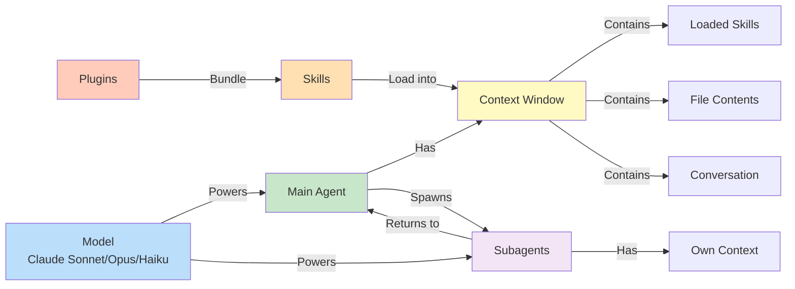
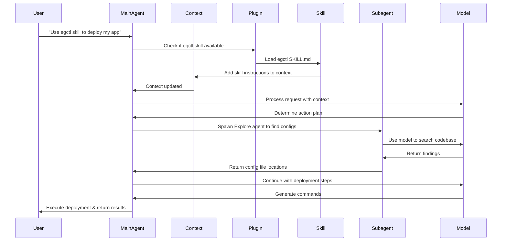
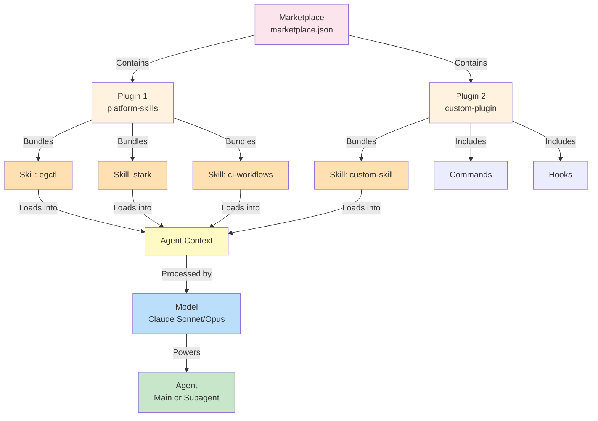
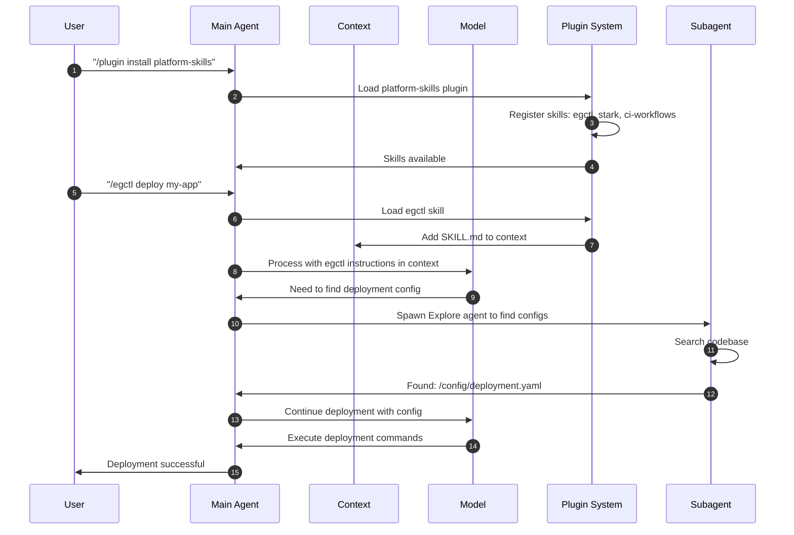
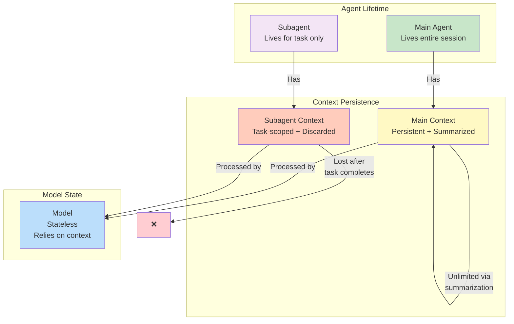

# Claude Code Architecture

This document explains the architecture of Claude Code, including the relationships between the main agent, subagents, skills, plugins, context, and models.

## System Architecture

```mermaid
graph TB
    subgraph USER["👤 USER INTERACTION"]
        U[User]
    end

    subgraph SESSION["CLAUDE CODE SESSION"]
        subgraph MAIN["🤖 MAIN AGENT"]
            CTX["📦 Context Window<br/>• Conversation history<br/>• System prompts<br/>• Loaded skills (SKILL.md)<br/>• File contents<br/>• Tool results<br/>• CLAUDE.md"]
            MODEL1["🧠 Model<br/>Claude Sonnet 4.5<br/>or Opus 4.6"]
            TOOLS["🛠️ Tools<br/>• Read/Write/Edit<br/>• Glob/Grep<br/>• Bash<br/>• Task (spawn subagents)<br/>• Skill (load skills)<br/>• WebFetch<br/>• AskUserQuestion"]

            CTX <--> MODEL1
            MODEL1 <--> TOOLS
        end

        subgraph SUBAGENTS["🤖 SUBAGENTS (Spawned via Task tool)"]
            SA1["Explore Agent<br/>• Fast codebase search<br/>• Code analysis<br/>• Pattern finding"]
            SA2["Plan Agent<br/>• Implementation planning<br/>• Architecture design<br/>• Approach strategy"]
            SA3["Bash Agent<br/>• Git operations<br/>• Terminal commands<br/>• System tasks"]
            SA4["Code Reviewer<br/>• Quality checks<br/>• Best practices<br/>• Security review"]
            SA5["General Purpose<br/>• Multi-step tasks<br/>• Complex research<br/>• Autonomous work"]

            SANOTE["Each subagent has:<br/>✓ Own context window<br/>✓ Same/different model<br/>✓ Specialized tools<br/>✓ Autonomous operation<br/>✓ Returns to main agent"]
        end
    end

    subgraph EXTEND["PLUGINS & SKILLS LAYER"]
        subgraph PLUGINS["📦 PLUGINS (Installed bundles)"]
            P1["platform-skills<br/>Bundle of EG platform skills"]
            P2["custom-plugin<br/>Skills + Commands + Hooks"]
            P3["other-plugins<br/>Specialized bundles"]
        end

        subgraph SKILLS["📄 SKILLS (Individual instruction sets)"]
            S1["egctl skill<br/>SKILL.md + scripts/"]
            S2["stark skill<br/>SKILL.md + references/"]
            S3["commit skill<br/>SKILL.md + assets/"]
            S4["ci-workflows skill<br/>SKILL.md"]
            S5["cloud-infrastructure skill<br/>SKILL.md"]

            SNOTE["Each skill:<br/>• SKILL.md (instructions)<br/>• scripts/ (optional)<br/>• references/ (optional)<br/>• assets/ (optional)"]
        end
    end

    subgraph MARKET["🏪 MARKETPLACE"]
        MKT["marketplace.json<br/>• Plugin registry<br/>• Skill bundles<br/>• Metadata"]
    end

    %% Connections
    U <-->|"Chat interface"| MAIN
    TOOLS -->|"Task tool spawns"| SUBAGENTS
    SUBAGENTS -->|"Results return to"| MAIN

    PLUGINS -->|"Contains"| SKILLS
    SKILLS -->|"Loaded into<br/>/skill-name"| CTX
    MKT -->|"Defines"| PLUGINS

    U -->|"/plugin install"| PLUGINS
    U -->|"/skill-name"| SKILLS

    style USER fill:#e1f5ff
    style SESSION fill:#fff4e1
    style MAIN fill:#e8f5e9
    style SUBAGENTS fill:#f3e5f5
    style EXTEND fill:#fff3e0
    style MARKET fill:#fce4ec
    style CTX fill:#c8e6c9
    style MODEL1 fill:#bbdefb
```



## Component Relationships



## Interaction Flow Sequence



## Hierarchy Overview



## Key Concepts

### 🧠 **Model**
The underlying AI (Claude Sonnet 4.5, Opus 4.6, Haiku) that provides intelligence. The same model type can power multiple agents (main + subagents), though each can optionally use different models.

**Key Characteristics:**
- Powers cognitive capabilities
- Processes context to generate responses
- Can be switched (sonnet for main, haiku for quick tasks)
- Stateless (relies on context for memory)

### 🤖 **Main Agent**
The primary Claude instance the user directly interacts with.

**Responsibilities:**
- Orchestrates entire session
- Maintains conversation with user
- Has full tool access
- Can spawn and coordinate subagents
- Makes final decisions

**Key Characteristics:**
- Single instance per session
- User-facing interface
- Full autonomy and authority
- Persistent throughout session

### 🤖 **Subagents**
Specialized Claude instances spawned by the main agent for specific tasks.

**Available Types:**
- **Explore**: Fast codebase exploration and analysis
- **Plan**: Implementation planning and design
- **Bash**: Git operations and terminal commands
- **Code Reviewer**: Quality and security checks
- **General Purpose**: Complex multi-step tasks

**Key Characteristics:**
- Spawned via Task tool
- Autonomous operation with own context
- Can use different models (optimize for speed/cost)
- Return results to main agent
- Temporary (exist only for their task)

### 📦 **Context**
The "memory" available to an agent during execution.

**Contents:**
- Conversation history
- System prompts and instructions
- Loaded skills (SKILL.md content)
- File contents (from Read tool)
- Tool results
- Project instructions (CLAUDE.md)

**Key Characteristics:**
- Each agent has its own context window
- Unlimited through automatic summarization
- Context is what the model processes
- More context = better informed decisions
- Lost when agent terminates (for subagents)

### 📄 **Skills**
Individual instruction sets that provide domain-specific knowledge.

**Structure:**
```
skills/egctl/
  ├── SKILL.md           # Main instructions + metadata
  ├── scripts/           # Optional executable code
  ├── references/        # Optional additional docs
  └── assets/            # Optional templates/data
```

**Key Characteristics:**
- Follow Agent Skills specification (agentskills.io)
- Loaded into agent context when invoked (`/egctl`)
- Provide step-by-step procedures
- Can be shared across multiple plugins
- Versioned independently (release-please)

**Frontmatter Required:**
```yaml
---
name: egctl
description: Deploy and manage applications with egctl
metadata:
  version: 1.0.0 # x-release-please-version
  author: Expedia Group
---
```

### 📦 **Plugins**
Bundles that package related skills, commands, hooks, and configuration.

**Two Types:**

1. **Skill Bundles** - Collections of related skills
   ```json
   {
     "name": "platform-skills",
     "source": "./",
     "skills": ["./skills/egctl", "./skills/stark"]
   }
   ```

2. **Custom Plugins** - Full Claude Code plugins
   ```
   plugins/custom-plugin/
     ├── plugin.json       # Plugin metadata
     ├── skills/           # Bundled skills
     ├── commands/         # Custom commands
     └── hooks/            # Event hooks
   ```

**Key Characteristics:**
- Installed via `/plugin install <name>`
- Defined in `.claude-plugin/marketplace.json`
- Can contain multiple skills
- Enable sharing of related capabilities
- Versioned independently

## Installation & Usage

### Installing Plugins (Claude Code)
```bash
# Add marketplace
/plugin marketplace add eg-internal/skills

# List available plugins
/plugin marketplace list

# Install a plugin (loads all its skills)
/plugin install platform-skills
```

### Installing Skills (Other AI Agents)
```bash
# Interactive selection
DISABLE_TELEMETRY=1 npx skills add eg-internal/skills

# Specific skill
DISABLE_TELEMETRY=1 npx skills add eg-internal/skills --skill egctl

# Specific agent
DISABLE_TELEMETRY=1 npx skills add eg-internal/skills --skill egctl --agent cursor
```

### Using Skills
```bash
# In Claude Code
/egctl          # Invokes egctl skill
/stark          # Invokes stark skill

# Skills are loaded into context and guide the agent's behavior
```

## Data Flow Example



## Memory & State



## Summary

| Component | Purpose | Lifetime | Scope |
|-----------|---------|----------|-------|
| **Model** | AI intelligence provider | Stateless (per request) | Powers all agents |
| **Main Agent** | User-facing orchestrator | Entire session | Global coordination |
| **Subagent** | Specialized task worker | Single task | Task-specific |
| **Context** | Agent memory/knowledge | Agent lifetime | Per agent |
| **Skill** | Domain instructions | Loaded on demand | Loaded into context |
| **Plugin** | Capability bundle | Installed once | Session-wide |
| **Marketplace** | Plugin registry | Static configuration | Repository-wide |

**Relationship Chain:**
```
Marketplace → Plugins → Skills → Context → Model → Agent → User
```

**Installation Chain:**
```
User installs Plugin → Plugin bundles Skills → Skills load into Context → Context feeds Model → Model powers Agent
```

**Execution Chain:**
```
User request → Main Agent → Model processes Context → Agent uses Tools → May spawn Subagent → Results to User
```
