# Claude Code Explained - A Beginner's Guide

This guide explains Claude Code features from the ground up. No prior knowledge needed!

## What is Claude Code?

Claude Code is an AI coding assistant that lives in your terminal. Think of it like having an expert programmer sitting next to you, but instead of typing messages in a chat, it can:
- Read and write files in your project
- Search your codebase
- Run terminal commands
- Browse the web for information
- And much more!

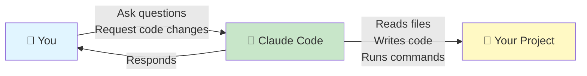

## The Big Picture: How to Extend Claude Code

Out of the box, Claude Code can read files, write code, search, and run commands. But you can **extend** it with additional capabilities:

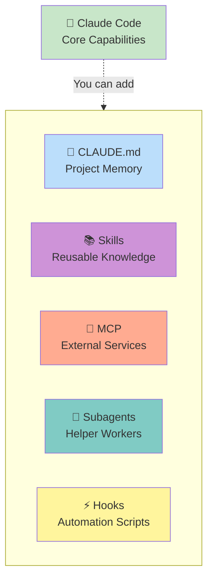

Let's understand each extension one by one.

---

## 1. CLAUDE.md - Project Memory

### What is it?
A special file in your project that Claude reads **every single time** you start a conversation.

### Real-World Analogy
Think of it like a sticky note on your monitor that says:
- "Always use spaces, not tabs"
- "Our database is PostgreSQL"
- "Run `npm test` before committing"

### How it Works

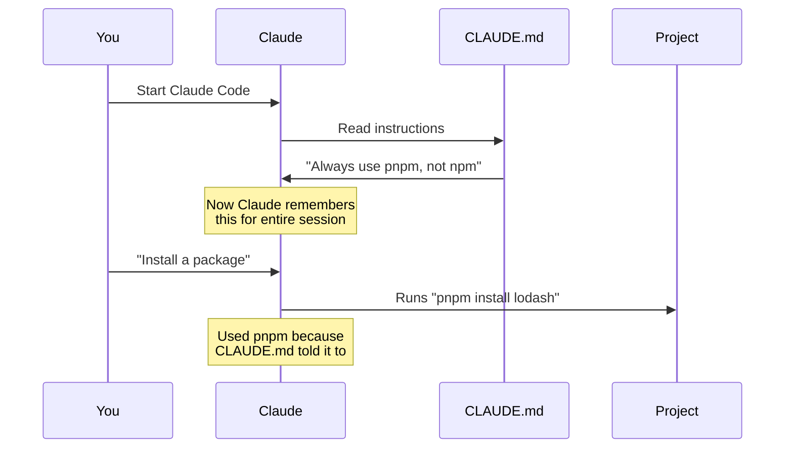

### Example

**File: `/your-project/CLAUDE.md`**
```markdown
# Project Guidelines

## Package Manager
Always use `pnpm` instead of npm.

## Testing
Run `npm test` before committing any changes.

## Code Style
- Use TypeScript for all new files
- Follow ESLint rules
- Maximum line length: 100 characters
```

### When to Use
- Project-wide rules that **always** apply
- Build commands
- "Never do X" rules
- Code conventions

### When NOT to Use
- Large reference documentation (use Skills instead)
- Things that only matter sometimes
- Keep it under ~500 lines

---

## 2. Skills - Reusable Knowledge & Workflows

### What is it?
A package of instructions, knowledge, or a workflow that Claude can use when needed.

### Real-World Analogy
Like a recipe book. You don't need to read every recipe when cooking dinner - you only open the book when you need a specific recipe. Similarly, Skills load only when needed.

### Two Types of Skills

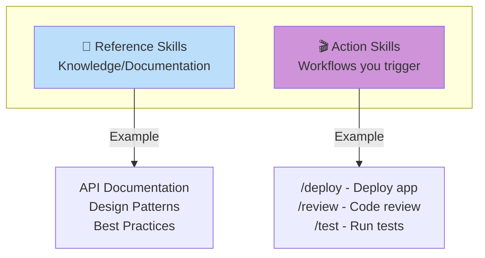

### How Skills Work

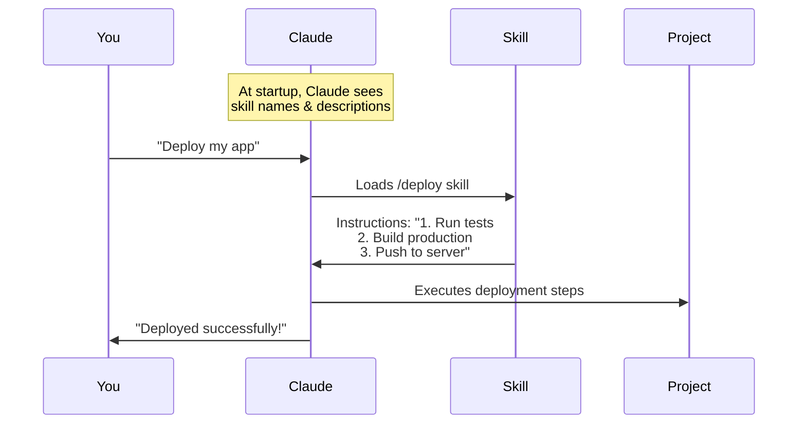

### Example: Action Skill

**File: `/skills/deploy/SKILL.md`**
```markdown
---
name: deploy
description: Deploy the application to production
---

# Deployment Workflow

When the user asks to deploy:

1. Run `npm test` to ensure tests pass
2. Run `npm run build` to create production build
3. Run `./deploy.sh` to push to server
4. Verify deployment at https://myapp.com
```

**Usage:**
```bash
You: /deploy
Claude: Running tests... ✓
        Building... ✓
        Deploying... ✓
        Verified at https://myapp.com
```

### Example: Reference Skill

**File: `/skills/api-guide/SKILL.md`**
```markdown
---
name: api-guide
description: API design patterns and conventions for our services
---

# API Guidelines

## Endpoint Naming
- Use plural nouns: `/users` not `/user`
- Use kebab-case: `/user-profiles` not `/userProfiles`

## Response Format
Always return JSON:
{
  "data": {...},
  "error": null,
  "timestamp": "2024-01-01T00:00:00Z"
}
```

**Usage:** Claude loads this automatically when you ask about APIs.

### When to Use
- Repeatable workflows you trigger with `/command-name`
- Reference documentation (API docs, style guides)
- Domain-specific knowledge
- Things that don't need to be in every conversation

---

## 3. Subagents - Helper Workers

### What is it?
A **separate copy of Claude** that works on a specific task in isolation, then reports back.

### Real-World Analogy
Like asking a coworker to research something. They go off, do the research, and come back with a summary. They don't need to know about your entire day - just their specific task.

### Why Use Subagents?

**Problem:** If Claude reads 50 files to research something, your conversation gets cluttered.

**Solution:** Send a subagent to do the research. The subagent reads all 50 files in isolation, then returns just the summary.

### How Subagents Work

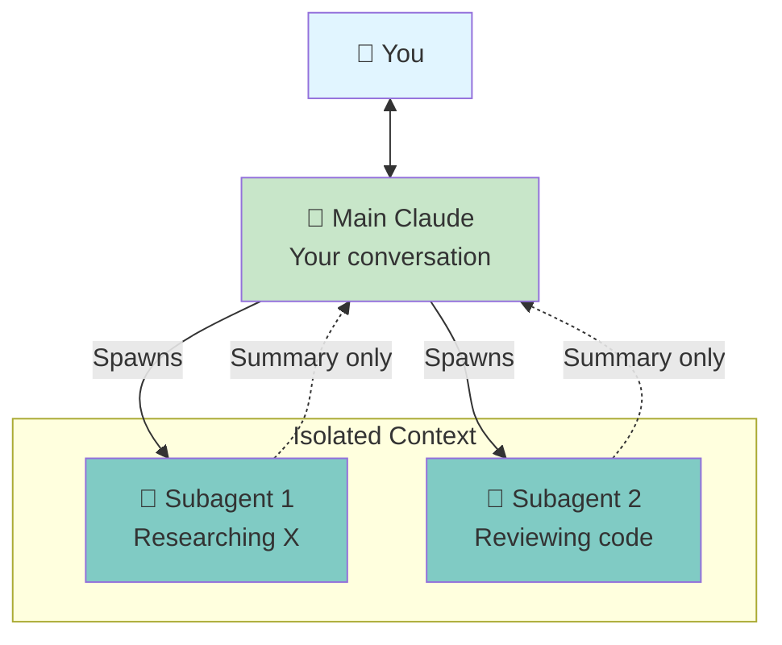

### Example Flow

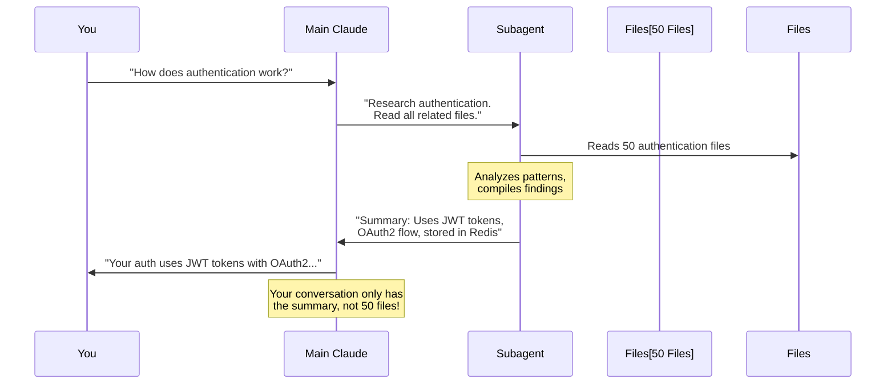

### Built-in Subagent Types

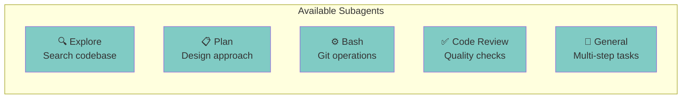

### When to Use
- Tasks that need to read many files
- Research questions
- Parallel work (run multiple subagents at once)
- Keep your main conversation clean

---

## 4. MCP (Model Context Protocol) - External Services

### What is it?
A way to connect Claude to external services like databases, Slack, Jira, etc.

### Real-World Analogy
Like giving Claude a phone with apps installed. Without MCP, Claude can't call anyone or use any apps. With MCP, Claude can "call" your database, "message" Slack, or "open" Jira.

### How MCP Works

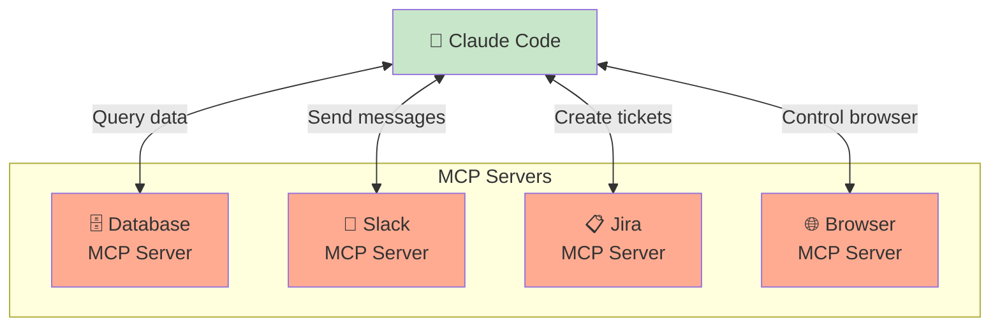

### Example: Database Connection

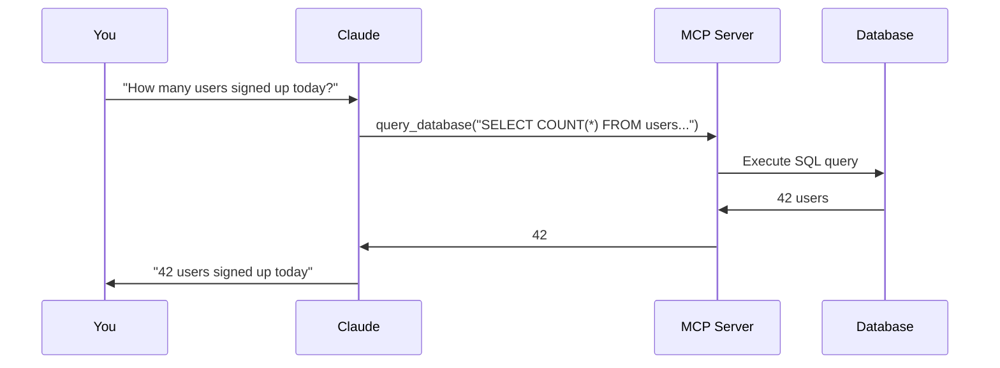

### Common MCP Servers
- **Database**: Query PostgreSQL, MySQL, etc.
- **Slack**: Send messages, read channels
- **GitHub**: Create issues, PRs
- **Jira**: Create/update tickets
- **Browser**: Control Chrome for testing
- **File System**: Extended file operations

### When to Use
- Need to access external data (databases, APIs)
- Need to perform external actions (post to Slack, create tickets)
- Integrate with your existing tools

---

## 5. Hooks - Automation Scripts

### What is it?
Scripts that run automatically when specific events happen.

### Real-World Analogy
Like "If This Then That" (IFTTT).
- **IF** Claude edits a file, **THEN** run ESLint
- **IF** conversation ends, **THEN** save a summary

### How Hooks Work

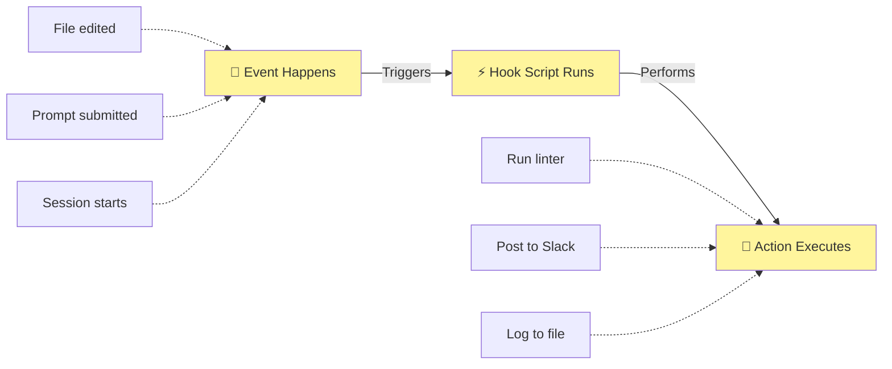

### Example Hook

**Scenario:** Automatically run ESLint whenever Claude edits a JavaScript file.

**File: `.claude/hooks/post-edit.sh`**
```bash
#!/bin/bash
# Runs after every file edit

if [[ "$FILE" == *.js ]]; then
  echo "Running ESLint on $FILE..."
  eslint "$FILE" --fix
fi
```

**What Happens:**
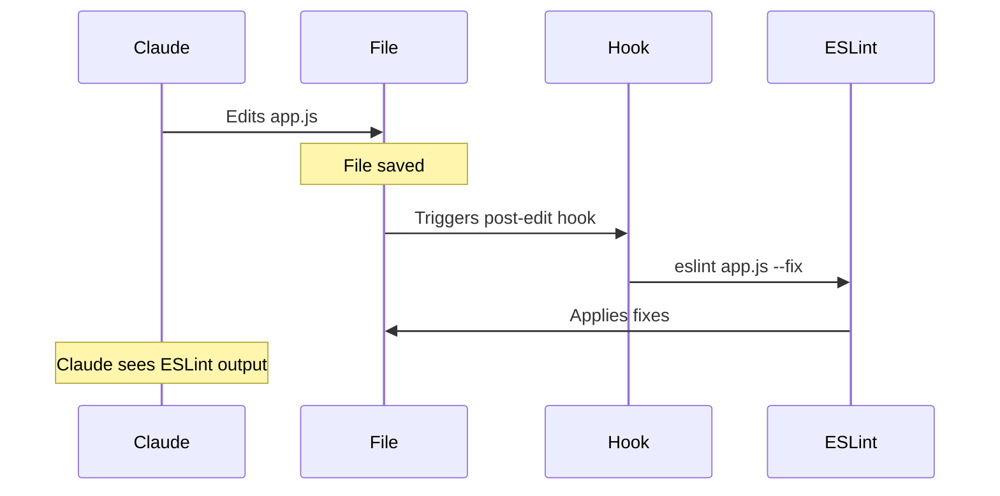

### Available Hook Events
- **post-edit**: After file edits
- **pre-bash**: Before running commands
- **post-bash**: After commands finish
- **session-start**: When Claude Code starts
- **session-end**: When you exit
- **prompt-submit**: When you send a message

### When to Use
- Automated checks (linting, formatting)
- Logging and monitoring
- Notifications (post to Slack when changes happen)
- Predictable automation that doesn't need AI

---

## 6. Plugins - Packaging It All Together

### What is it?
A bundle that packages skills, hooks, MCP servers, and configurations into one installable unit.

### Real-World Analogy
Like a browser extension. Instead of manually installing 5 different things, you install one plugin that includes everything.

### What Plugins Can Include

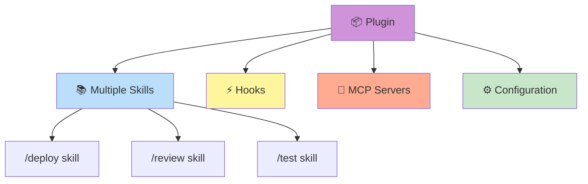

### When to Use
- Share capabilities across multiple projects
- Distribute to your team
- Package related features together

---

## How Features Work Together

Features often combine to create powerful workflows. Here are common patterns:

### Pattern 1: CLAUDE.md + Skills

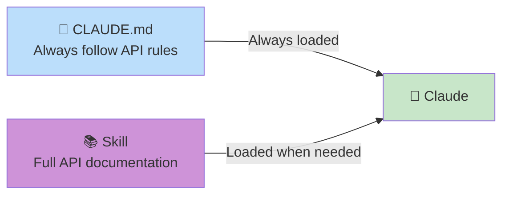

**Use Case:**
- CLAUDE.md: "Follow our API conventions"
- Skill: Contains 50-page API style guide
- Result: Claude always knows to follow API rules, loads full guide when building APIs

### Pattern 2: Skill + Subagent

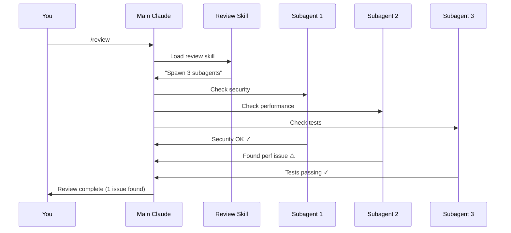

**Use Case:**
- `/review` skill triggers parallel code reviews
- Each subagent checks different aspect
- Results merge in main conversation

### Pattern 3: MCP + Skill

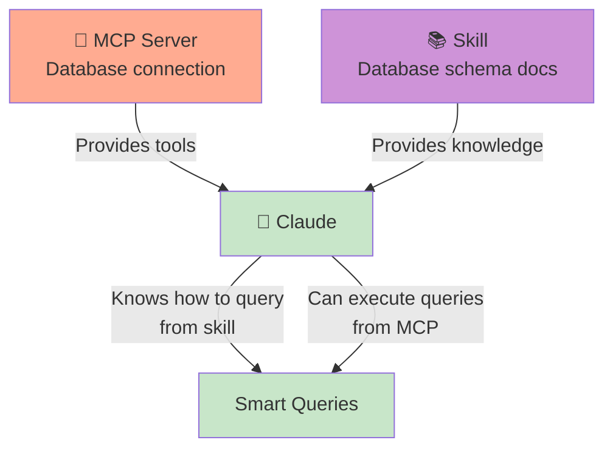

**Use Case:**
- MCP: Gives Claude ability to query database
- Skill: Teaches Claude your database schema
- Result: Claude can write smart queries using correct tables

---

## Decision Tree: Which Feature Should I Use?

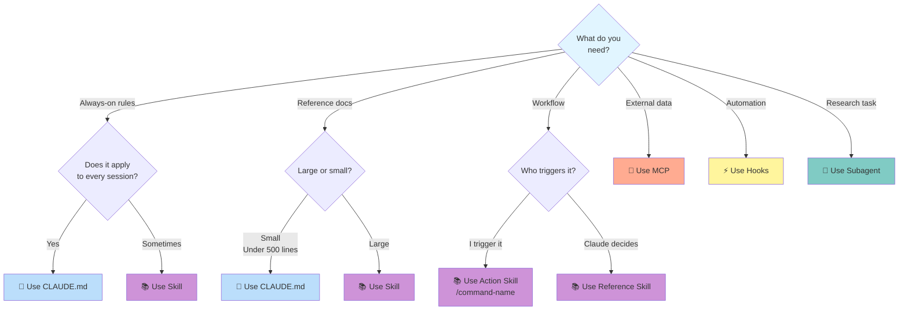

---

## Quick Reference Table

| Feature | Always On? | Context Cost | Best For | Example |
|---------|-----------|-------------|----------|---------|
| 📄 **CLAUDE.md** | ✅ Yes | High (always loaded) | Project rules, conventions | "Use pnpm, not npm" |
| 📚 **Skills** | ❌ No (on-demand) | Low until used | Workflows, reference docs | `/deploy` command, API guide |
| 🤖 **Subagents** | ❌ No (spawned) | Isolated context | Research, parallel work | "Research authentication across 50 files" |
| 🔌 **MCP** | ✅ Yes (tools) | Medium | External services | Query database, post to Slack |
| ⚡ **Hooks** | ✅ Yes (triggers) | Zero | Automation | Run ESLint after edits |
| 📦 **Plugins** | Depends | Varies | Bundle & distribute | Package skills+hooks together |

---

## Context and Memory Explained

One important concept: **context** is Claude's short-term memory for the current session.

### How Context Works

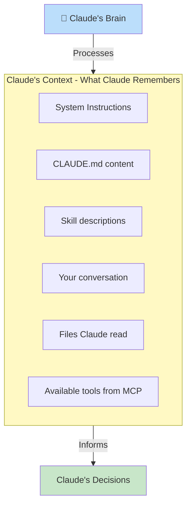

### Context Costs by Feature

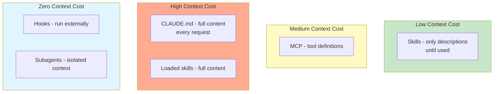

**Key Insight:** Use CLAUDE.md for essentials only. Move large docs to skills that load on-demand.

---

## Real-World Example: Complete Setup

Let's see how a real project might use all these features together.

### Scenario: E-commerce Platform Development

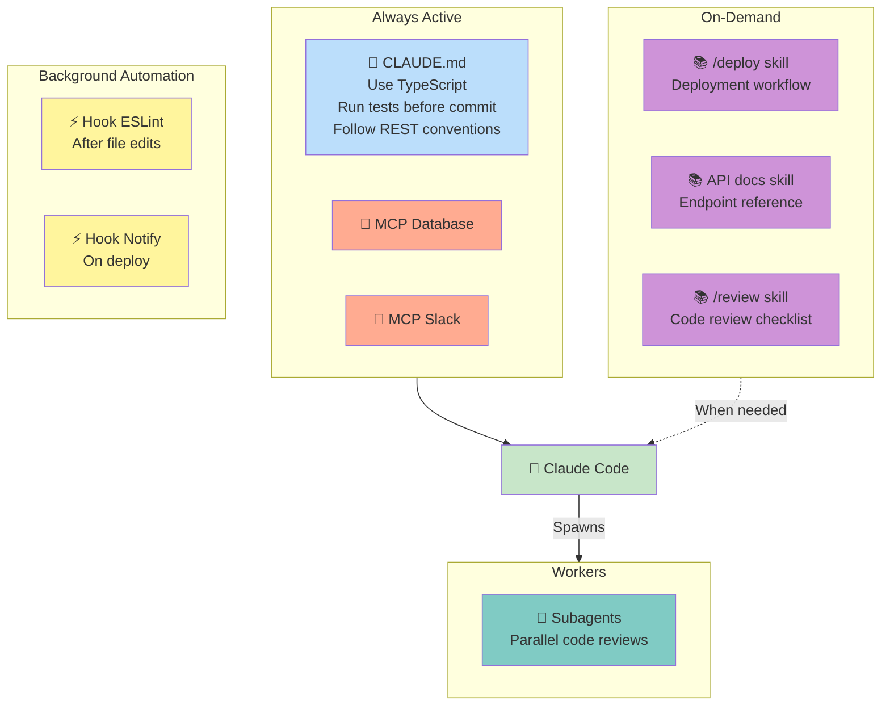

### What Each Piece Does

**CLAUDE.md** (Always active)
```markdown
# Project Rules
- Use TypeScript for all new files
- Run `npm test` before committing
- Follow REST API conventions in api-docs skill
```

**Skills** (Load when needed)
- `/deploy` - Full deployment workflow (you trigger)
- `api-docs` - 100-page API reference (Claude loads when needed)
- `/review` - Code review checklist (you trigger)

**MCP Servers** (Always connected)
- Database MCP - Query customer/order data
- Slack MCP - Send notifications

**Hooks** (Run on events)
- Post-edit hook - Run ESLint
- Post-deploy hook - Send Slack notification

**Subagents** (Spawned for big tasks)
- When you run `/review`, spawns 3 subagents:
  - Security checker
  - Performance analyzer
  - Test coverage checker

### Example Interaction

```mermaid
sequenceDiagram
    participant You
    participant Claude
    participant CLAUDE.md
    participant API Skill
    participant Database MCP
    participant Subagent

    Note over Claude: Session starts
    Claude->>CLAUDE.md: Reads rules

    You->>Claude: "Add an endpoint to get user orders"
    Claude->>API Skill: Loads API documentation
    Claude->>Database MCP: Queries schema

    Note over Claude: Writes code following<br/>TypeScript rules from CLAUDE.md<br/>API patterns from skill<br/>Database structure from MCP

    Claude->>You: Created /api/users/{id}/orders endpoint

    You->>Claude: /review
    Claude->>Subagent: Spawn security review
    Note over Subagent: Checks for SQL injection,<br/>auth issues, etc.
    Subagent->>Claude: Security: OK ✓

    Claude->>You: Review complete. All checks passed!
```

---

## Getting Started Checklist

Here's the recommended order to add features:

```mermaid
graph TD
    START[🎯 Starting Out]

    START --> STEP1[1️⃣ Create CLAUDE.md<br/>Add basic project rules]
    STEP1 --> STEP2[2️⃣ Add skills as needed<br/>Start with workflows you repeat]
    STEP2 --> STEP3[3️⃣ Connect MCP servers<br/>If you need external services]
    STEP3 --> STEP4[4️⃣ Try subagents<br/>For research and parallel work]
    STEP4 --> STEP5[5️⃣ Add hooks<br/>Automate repetitive tasks]
    STEP5 --> STEP6[6️⃣ Package as plugin<br/>Share with your team]

    style START fill:#e1f5ff
    style STEP1 fill:#bbdefb
    style STEP2 fill:#ce93d8
    style STEP3 fill:#ffab91
    style STEP4 fill:#80cbc4
    style STEP5 fill:#fff59d
    style STEP6 fill:#ce93d8
```

### Step 1: Start with CLAUDE.md

Create `/your-project/CLAUDE.md`:
```markdown
# Project Guidelines

## Language
Use TypeScript for all new files.

## Package Manager
Use pnpm instead of npm.

## Testing
Run tests before committing: `npm test`
```

### Step 2: Add Your First Skill

Create `/skills/deploy/SKILL.md`:
```markdown
---
name: deploy
description: Deploy the application
---

# Deployment Steps

1. Run tests: `npm test`
2. Build: `npm run build`
3. Deploy: `./deploy.sh`
```

Use it: `/deploy`

### Step 3: Try the Rest

As you need more capabilities, add:
- MCP servers for external services
- Subagents for research tasks
- Hooks for automation
- Plugins to share with team

---

## Summary: The Complete Picture

```mermaid
graph TB
    YOU[👤 You]

    subgraph CLAUDE_CODE[🤖 Claude Code System]
        MAIN[Main Claude<br/>Your Conversation]

        subgraph ALWAYS[Always Available]
            CM[📄 CLAUDE.md<br/>Project Memory]
            MCP[🔌 MCP<br/>External Services]
        end

        subgraph ONDEMAND[On-Demand]
            SK[📚 Skills<br/>Knowledge & Workflows]
            SA[🤖 Subagents<br/>Helper Workers]
        end

        subgraph AUTO[Automatic]
            HK[⚡ Hooks<br/>Event Scripts]
        end
    end

    PLUGIN[📦 Plugins<br/>Package Everything]

    YOU <--> MAIN
    ALWAYS --> MAIN
    ONDEMAND -.-> MAIN
    AUTO -.-> MAIN

    PLUGIN -.->|Bundles| CM
    PLUGIN -.->|Bundles| SK
    PLUGIN -.->|Bundles| MCP
    PLUGIN -.->|Bundles| HK

    style YOU fill:#e1f5ff
    style MAIN fill:#c8e6c9
    style CM fill:#bbdefb
    style SK fill:#ce93d8
    style MCP fill:#ffab91
    style SA fill:#80cbc4
    style HK fill:#fff59d
    style PLUGIN fill:#ce93d8
```

### Remember

1. **Start simple** - Begin with CLAUDE.md for basic rules
2. **Add as needed** - Don't over-engineer. Add skills when you have repeated workflows
3. **Keep it clean** - Put only essentials in CLAUDE.md, use skills for the rest
4. **Isolate when needed** - Use subagents to keep your main conversation focused
5. **Automate the boring** - Use hooks for predictable automation
6. **Share with team** - Package as plugins once your setup is solid

---

## Where to Learn More

- **CLAUDE.md**: [Documentation](https://code.claude.com/docs/en/memory)
- **Skills**: [Documentation](https://code.claude.com/docs/en/skills)
- **Subagents**: [Documentation](https://code.claude.com/docs/en/sub-agents)
- **MCP**: [Documentation](https://code.claude.com/docs/en/mcp)
- **Hooks**: [Documentation](https://code.claude.com/docs/en/hooks)
- **Plugins**: [Documentation](https://code.claude.com/docs/en/plugins)

---

## Quick Glossary

| Term | Simple Definition |
|------|------------------|
| **Context** | Claude's short-term memory for the current session |
| **Skill** | A package of instructions or workflows Claude can use |
| **Subagent** | A helper Claude that works on tasks in isolation |
| **MCP** | Connection to external services (database, Slack, etc.) |
| **Hook** | Script that runs automatically on events |
| **Plugin** | Bundle of skills, hooks, and configurations |
| **CLAUDE.md** | File Claude reads every session for project rules |
| **Marketplace** | Place to discover and install plugins |

---

That's it! You now understand all the core concepts of extending Claude Code. Start with CLAUDE.md and add features as you need them. Happy coding! 🚀
