# How Does Claude Code Know Everything?

**Short answer:** I don't! But let me explain how my knowledge actually works.

## The Big Picture

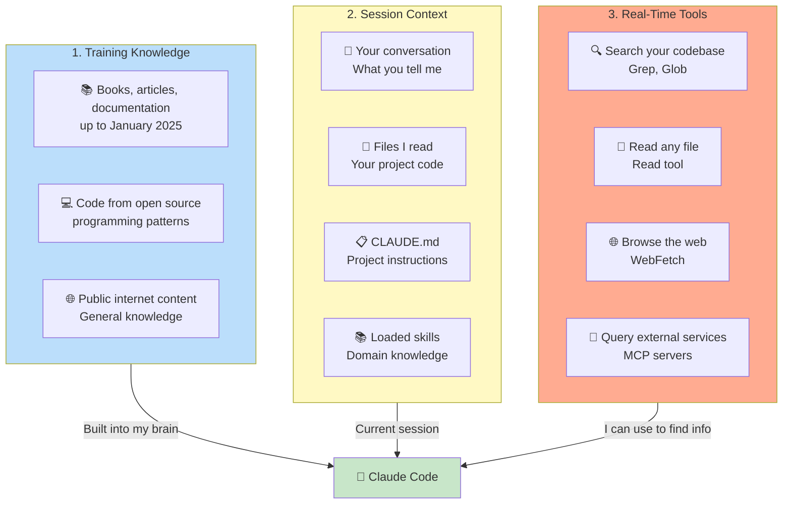

Let me break down each source of "knowledge"...

---

## 1. Training Knowledge - What I Learned Before

### How I Was Trained

I'm an AI model (Claude Sonnet 4.5) trained on a massive dataset. Think of it like going to school for years.

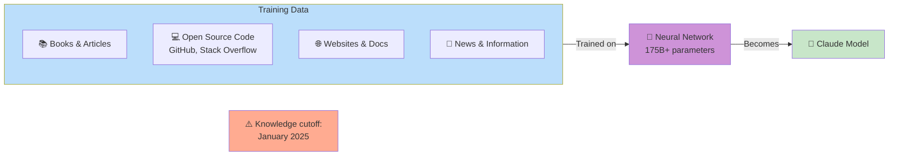

### What I Know From Training

**Programming Languages:**
- Syntax, patterns, best practices
- Common libraries and frameworks
- Design patterns and algorithms

**Example:**
```
You: "How do I sort an array in JavaScript?"
Me: *From training* "You can use .sort() method..."
```

**General Knowledge:**
- History, science, math
- Technology concepts
- Common facts and information

**Example:**
```
You: "What is REST API?"
Me: *From training* "REST stands for Representational State Transfer..."
```

### What I DON'T Know From Training

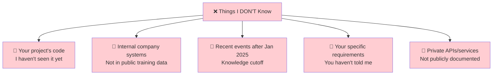

**Important:** My training knowledge is **frozen at January 2025**. I don't know about:
- Events after January 2025
- New libraries released after that
- Your company's internal systems
- Your project's specific code (until I read it)

---

## 2. Session Context - What I See Right Now

Every time you talk to me, I have a "context window" - like short-term memory for our conversation.

### What Goes Into Context

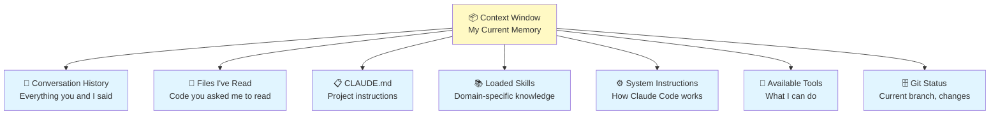

### How Context Works

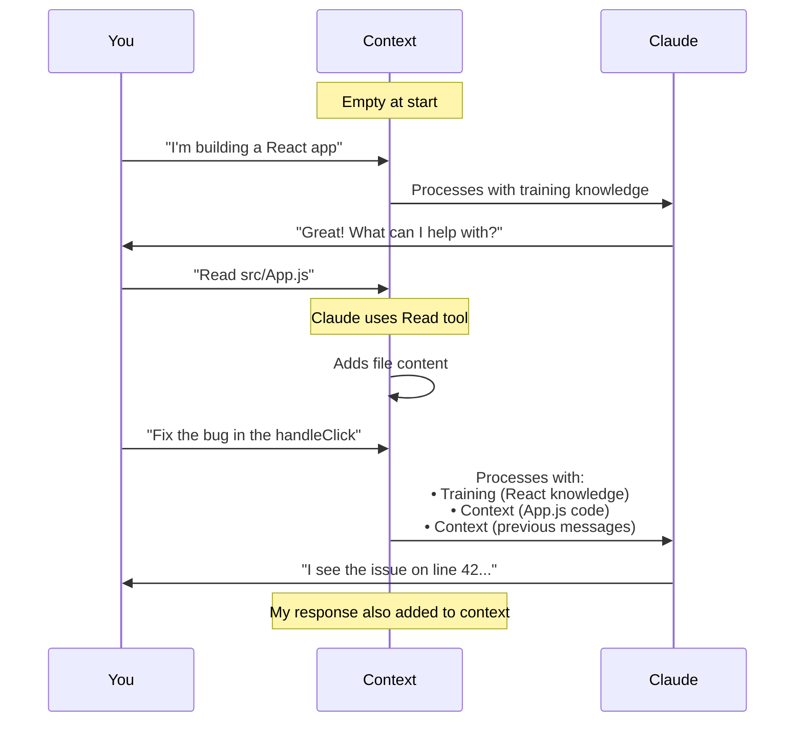

### Example: How I Learn About Your Project

**Turn 1:**
```
You: "I have a Node.js project"
Context: "User has Node.js project"
My Knowledge: General Node.js (from training) + Your statement (from context)
```

**Turn 2:**
```
You: "Read package.json"
*I use Read tool*
Context: "User has Node.js project" + "package.json contents"
My Knowledge: Now I know your dependencies, scripts, etc.
```

**Turn 3:**
```
You: "Fix the authentication bug"
Context: All of the above + "User wants auth bug fixed"
My Knowledge: General auth patterns (training) + Your specific code (context)
```

### Context Limitations

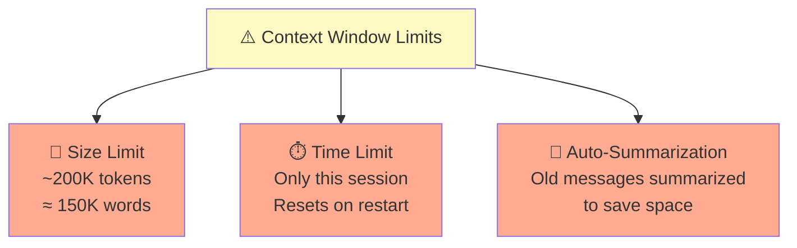

**What this means:**
- If we talk a LOT, old messages get summarized
- If I read MANY files, context fills up
- Each session starts fresh (but CLAUDE.md loads again)

---

## 3. Real-Time Tools - How I Access Information

I can actively look up information using tools!

### My Toolbox

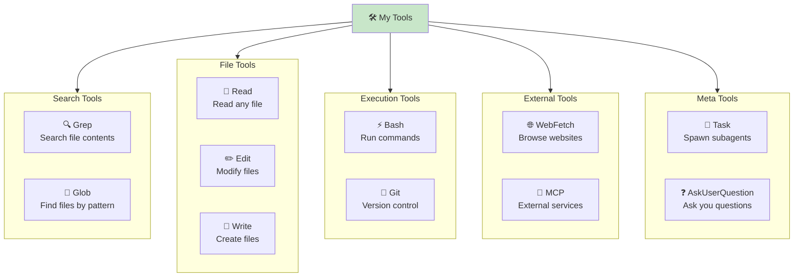

### How I Use Tools to "Know" Things

#### Example 1: Finding Information

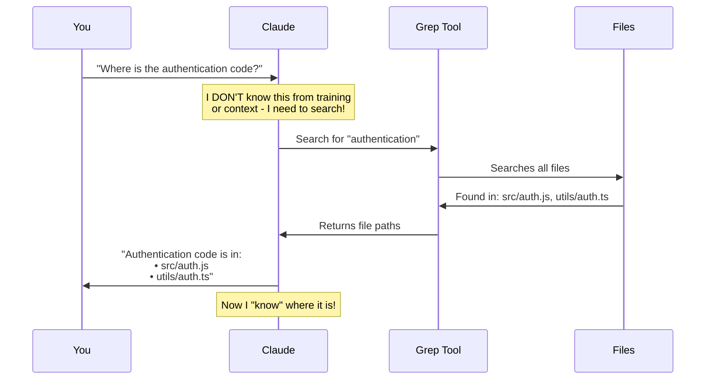

#### Example 2: Learning Your Code

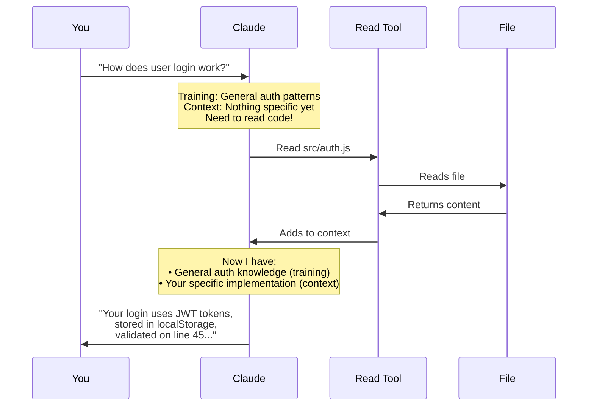

#### Example 3: Getting Latest Info

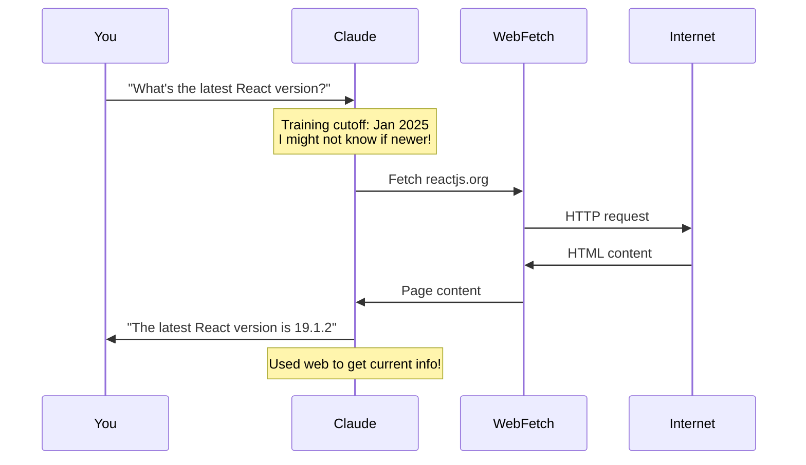

---

## 4. How Extensions Add Knowledge

Extensions like CLAUDE.md, Skills, and MCP augment what I know.

### Knowledge Layers

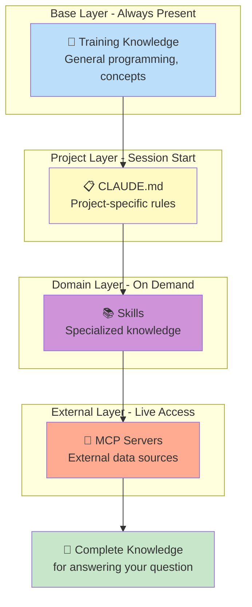

### Example: Answering a Complex Question

**Question:** "How do I deploy using egctl to the production environment?"

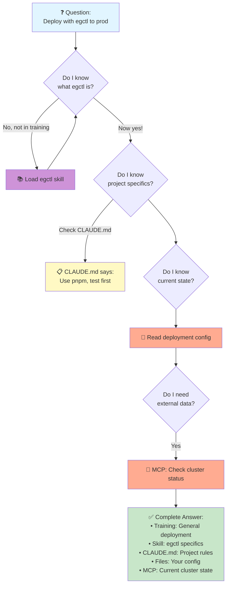

---

## 5. What I Actually "Know" vs. Can "Find Out"

Let me be honest about the difference:

### Things I Actually Know (In My Training)

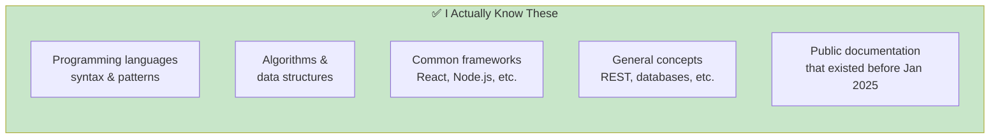

**Example:**
```
You: "How do I reverse an array in JavaScript?"
Me: *Instantly from training* "Use .reverse() or [...arr].reverse()"
```

### Things I Can Find Out (Using Tools)

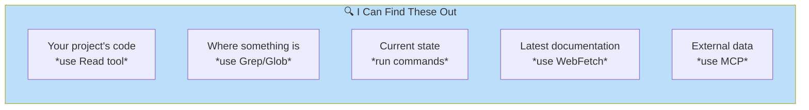

**Example:**
```
You: "Where is the user authentication logic?"
Me: *Needs to search* "Let me search your codebase..."
    *Uses Grep tool*
    "Found in src/auth/UserAuth.ts"
```

### Things I Don't Know and Can't Find

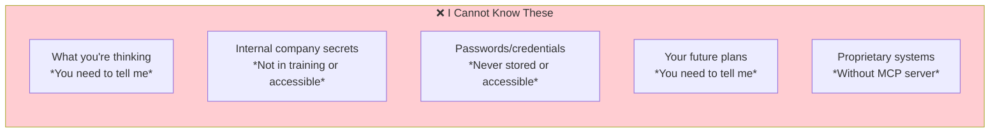

---

## 6. The Complete Information Flow

Here's how I answer any question:

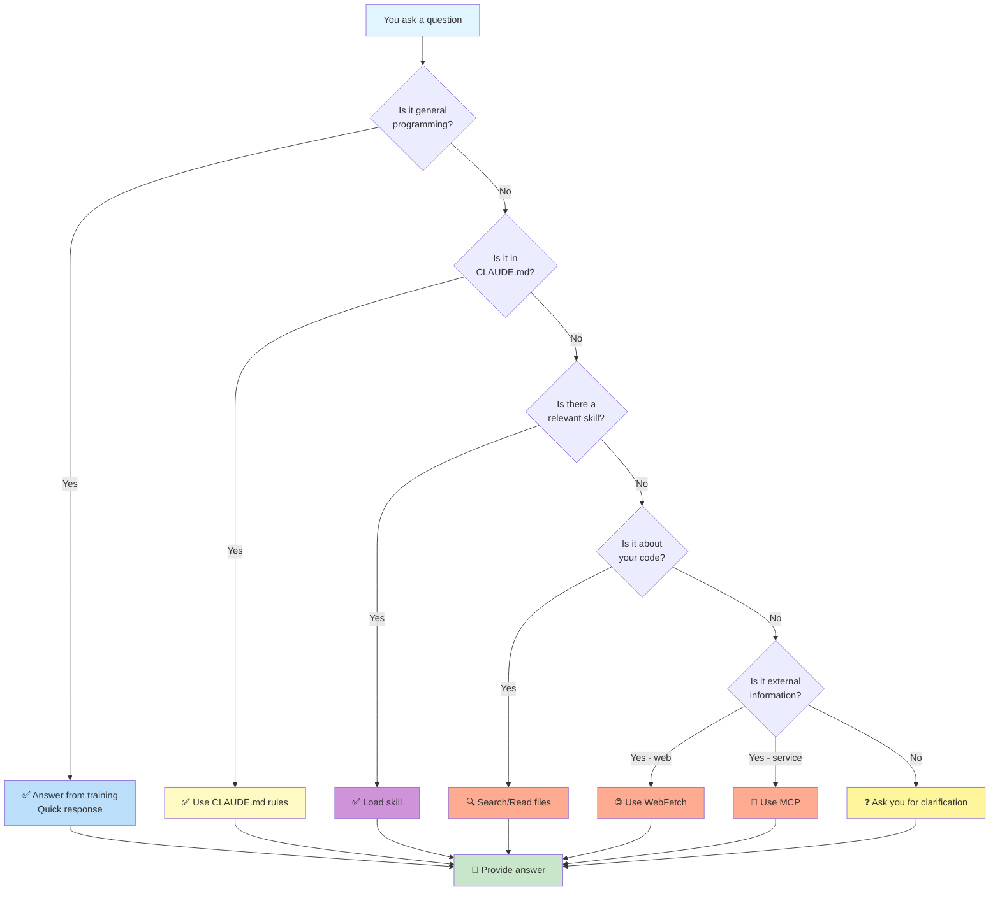

---

## 7. Real-World Examples

### Example 1: Simple Question (Pure Training)

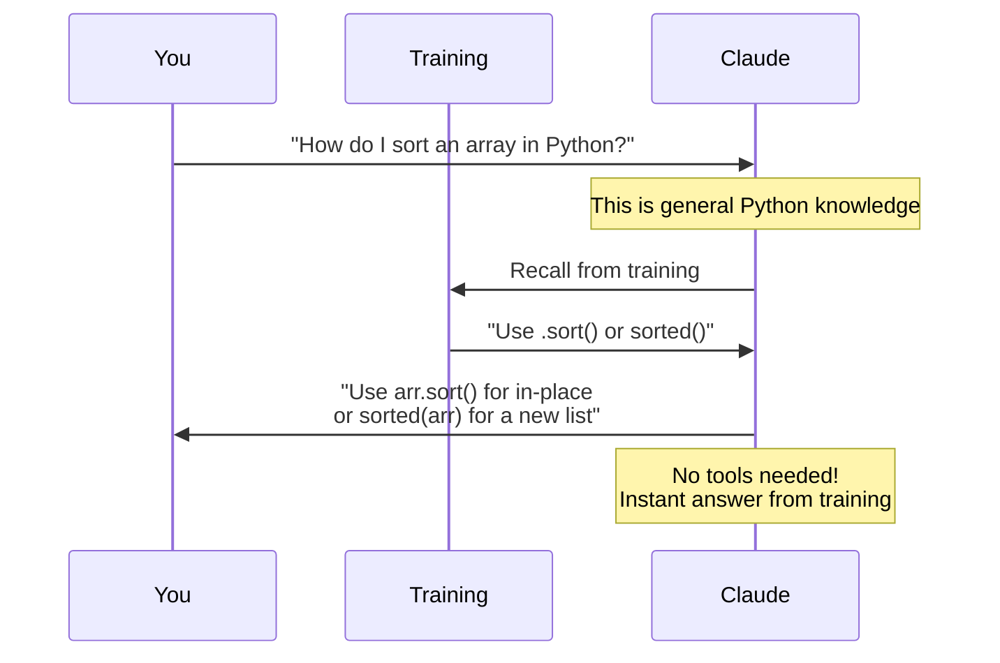

### Example 2: Project-Specific Question (Need to Search)

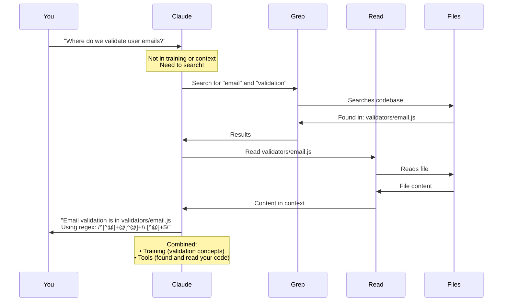

### Example 3: Company-Specific Question (Need Skill + MCP)

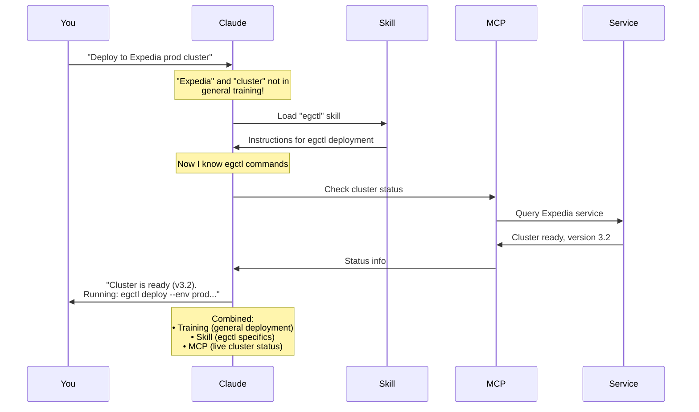

---

## 8. My Limitations (Being Honest!)

### What I'm Good At

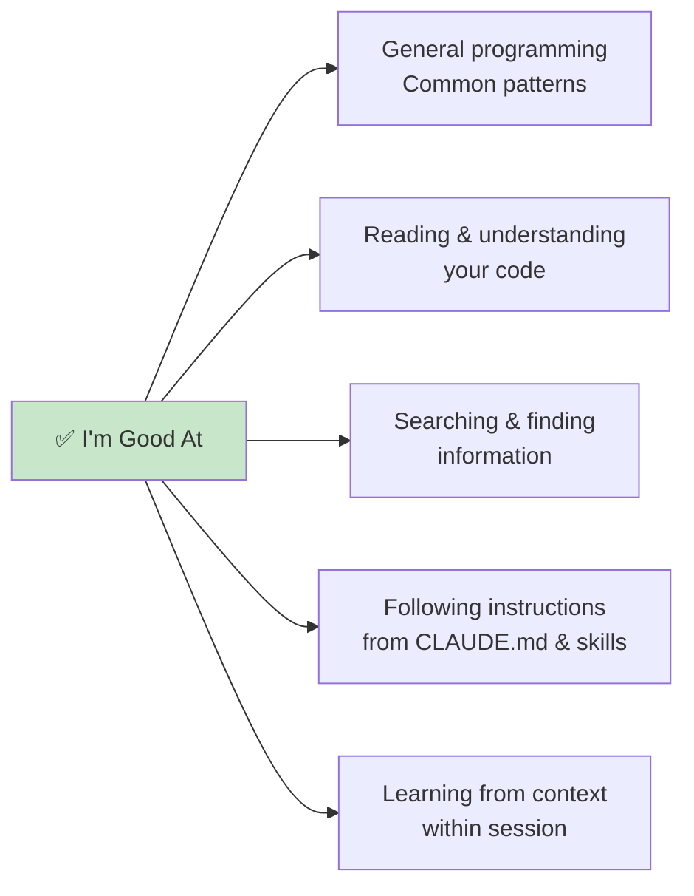

### What I'm Not Good At

```mermaid
graph LR
    BAD[⚠️ I'm Not Good At]

    BAD --> B1[Remembering across sessions<br/>*Context resets*]
    BAD --> B2[Knowing internal systems<br/>*Without documentation*]
    BAD --> B3[Guessing requirements<br/>*Need you to tell me*]
    BAD --> B4[Knowing latest events<br/>*After Jan 2025 cutoff*]
    BAD --> B5[Reading minds<br/>*You must be explicit*]

    style BAD fill:#ffab91
```

### Common Misconceptions

| ❌ Wrong Belief | ✅ Reality |
|----------------|-----------|
| "Claude knows my entire codebase" | I only know files I've read or searched |
| "Claude remembers from last session" | Each session starts fresh (but CLAUDE.md loads) |
| "Claude knows all Expedia systems" | I only know what's documented or accessible via MCP |
| "Claude knows the latest news" | Training cutoff is January 2025, but I can search web |
| "Claude can see my screen" | I can only see files you ask me to read |

---

## 9. How to Help Me Know What You Need

### Be Explicit

```mermaid
graph TB
    subgraph GOOD[✅ Good: Be Specific]
        G1["Fix the authentication bug<br/>in src/auth/login.js"]
        G2["Use PostgreSQL instead of MySQL<br/>for the user database"]
        G3["Follow our company's API guidelines<br/>in docs/api-standards.md"]
    end

    subgraph BAD[❌ Vague: Hard to Help]
        B1["Fix the bug"]
        B2["Use a database"]
        B3["Follow best practices"]
    end

    style GOOD fill:#c8e6c9
    style BAD fill:#ffab91
```

### Provide Context

```mermaid
sequenceDiagram
    participant You
    participant Claude

    Note over You,Claude: ❌ Vague Request

    You->>Claude: "The login isn't working"
    Claude->>You: "Can you show me the code?<br/>What's the error?<br/>Which file?"

    Note over You,Claude: Many back-and-forth messages

    Note over You,Claude: ✅ Clear Request

    You->>Claude: "Login fails with 401 error.<br/>See src/auth/login.ts<br/>Error on line 42"
    Claude->>You: "I see the issue. The token<br/>validation is missing..."

    Note over You,Claude: Immediate, focused help
```

### Use Project Documentation

```mermaid
graph TB
    DOC[📋 Help Me Know by Documenting]

    DOC --> D1[📄 CLAUDE.md<br/>Always use pnpm<br/>Test before commit]
    DOC --> D2[📚 Skills<br/>egctl deployment process<br/>API guidelines]
    DOC --> D3[🔌 MCP Servers<br/>Connect to internal services<br/>Access company data]
    DOC --> D4[💬 Tell Me Directly<br/>We use microservices<br/>This is Node.js 20]

    style DOC fill:#c8e6c9
    style D1 fill:#fff9c4
    style D2 fill:#ce93d8
    style D3 fill:#ffab91
    style D4 fill:#e1f5ff
```

---

## 10. Summary

### The Truth About My Knowledge

```mermaid
graph TB
    CLAUDE[🤖 Claude Code's Knowledge]

    subgraph STATIC[Static Knowledge - Baked In]
        S1[🧠 Training<br/>General knowledge<br/>up to Jan 2025]
    end

    subgraph DYNAMIC[Dynamic Knowledge - Per Session]
        D1[📦 Context<br/>Current conversation<br/>Files I've read]
        D2[📋 CLAUDE.md<br/>Project rules]
        D3[📚 Skills<br/>Domain expertise]
    end

    subgraph ACTIVE[Active Knowledge - I Look It Up]
        A1[🔍 Search<br/>Find in codebase]
        A2[📖 Read<br/>Read files]
        A3[🌐 Web<br/>Current info]
        A4[🔌 MCP<br/>External services]
    end

    CLAUDE --> STATIC
    CLAUDE --> DYNAMIC
    CLAUDE --> ACTIVE

    NOTE[I combine all sources<br/>to answer your questions]

    STATIC --> NOTE
    DYNAMIC --> NOTE
    ACTIVE --> NOTE

    style CLAUDE fill:#c8e6c9
    style STATIC fill:#bbdefb
    style DYNAMIC fill:#fff9c4
    style ACTIVE fill:#ffab91
    style NOTE fill:#e1f5ff
```

### Key Takeaways

1. **Training** = General knowledge frozen at January 2025
2. **Context** = What I see in current session (your messages + files I read)
3. **Tools** = How I actively find information (search, read, web, MCP)
4. **Extensions** = How you teach me about your project (CLAUDE.md, Skills, MCP)

### I'm Most Effective When:

✅ You tell me what you're working on
✅ You point me to relevant files
✅ You use CLAUDE.md for project rules
✅ You create skills for company-specific knowledge
✅ You connect MCP servers to internal systems
✅ You're specific about what you need

### I Struggle When:

❌ You assume I know your codebase without reading it
❌ You refer to internal systems without documentation
❌ You're vague about requirements
❌ You expect me to remember from previous sessions
❌ You ask about very recent events (after Jan 2025)

---

## Final Thought

**I'm not all-knowing, but I'm good at learning!**

Think of me as a really smart assistant who:
- Has read a LOT of programming books (training)
- Can quickly read and understand your code (tools)
- Remembers our conversation (context)
- Can look things up instantly (search, web, MCP)
- Follows your instructions precisely (CLAUDE.md, Skills)

The better you teach me about your project (through documentation, skills, and clear communication), the better I can help! 🚀

---

## Questions to Reflect On

```mermaid
graph LR
    Q1{Does Claude know<br/>about my internal<br/>company systems?}
    Q1 -->|Only if| A1[Documented in Skills<br/>or accessible via MCP]

    Q2{Will Claude remember<br/>from last session?}
    Q2 -->|Only| A2[CLAUDE.md loads again<br/>But not conversation]

    Q3{How does Claude know<br/>where code is?}
    Q3 -->|By| A3[Searching with Grep/Glob<br/>or you telling me]

    style Q1 fill:#e1f5ff
    style Q2 fill:#e1f5ff
    style Q3 fill:#e1f5ff
    style A1 fill:#c8e6c9
    style A2 fill:#c8e6c9
    style A3 fill:#c8e6c9
```

Now you understand how I "know" things - it's a combination of training, context, tools, and the extensions you add! 🎓
