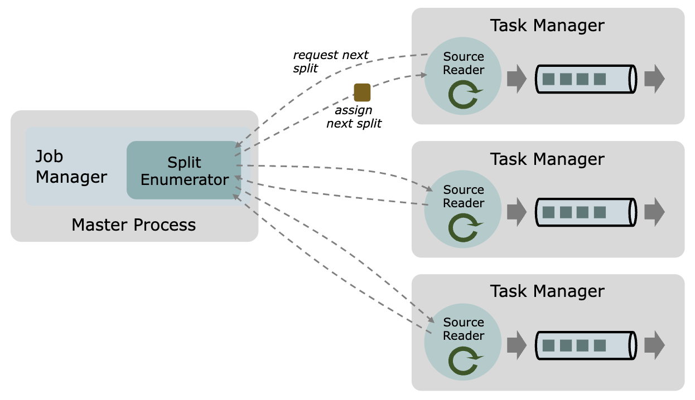
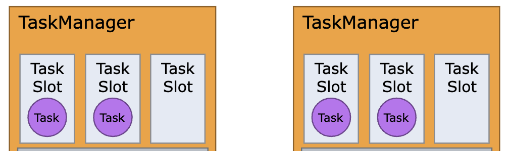

# Flink
Apache Flink is an open-source distributed processing framework designed for handling streaming data. When a user creates a flink job and submits it to a flink cluster, the job begins, and most processes are executed in the following sequence:

* Read messages from an external system
* Transform messages
* Load transformed messages into another external system

A common scenario involves fetching messages from Apache Kafka, processing them in real-time, and then loading the results into external systems such as Hadoop or S3.

## Essential Components of Apache Flink
Apache Flink has the JobManager and TaskManager. The JobManager receives flink jobs submitted by users and converts them into execution graphs that can be run in a distributed environment. It then assigns the generated tasks to the TaskManagers.

Furthermore, the JobManager also manages TaskManagers. When a TaskManager receives a task request from the JobManager, it executes the task and reports the results back to the JobManager.

Apache Flink also has the concept of a data source, consisting of three main modules: Split, SplitEnumerator, and SourceReader. These can be explained as follows, considering the roles of the JobManager and TaskManager:
* **Split**: An object sent from the JobManager to TaskManagers, which contains the implementation details on the position or criteria for reading data from an external system.
* **SplitEnumerator**: Resides in the JobManager and is responsible for assigning splits to TaskManagers.
* **SourceReader**: Resides in TaskManagers, requests splits to the JobManager, and reads data from the external system based on the assigned splits

A task is the work to be done, while a split is an object containing the position, criteria, and policies for reading data from external systems. In other words, a split is an object that provides the source operator with the necessary information to read data from external systems. The source operator is one of the operations within a task.

In addition, a TaskManager includes a module called a task slot, which is the entity that actually performs tasks. A TaskManager can execute multiple tasks simultaneously depending on the number of task slots it holds. The official documentation recommends assigning task slots equal to the number of CPU cores when starting a TaskManager. Therefore, considering a task slot as a single process for executing tasks will suffice for understanding this article.

## [Flink CDC sources](https://nightlies.apache.org/flink/flink-cdc-docs-master/docs/connectors/flink-sources/overview/#flink-cdc-sources)