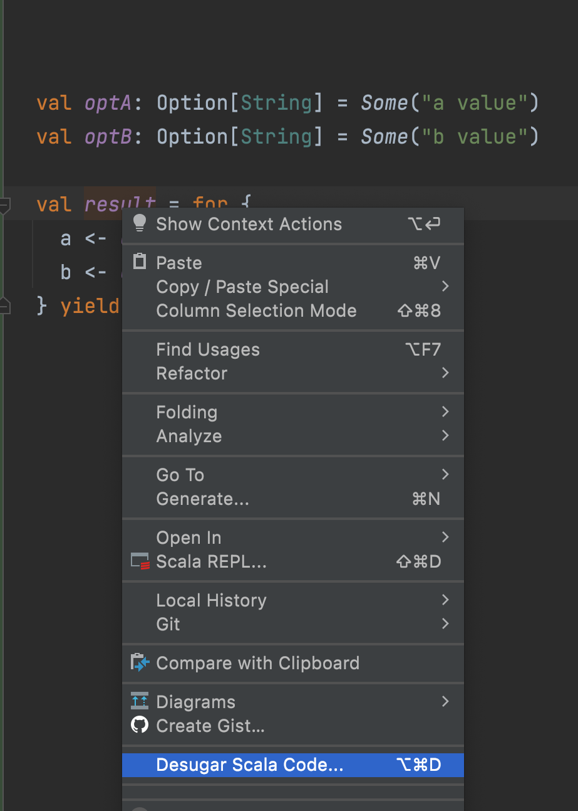

#### Using macros/quasiquotes
```scala
import scala.reflect.runtime.universe._

val optA: Option[String] = Some("a value")
val optB: Option[String] = Some("b value")
val tree =
  q"""
  for {
     a <- optA
     b <- optB
} yield (a,b)
"""
//reflect.runtime.universe.Tree = optA.flatMap(((a) => optB.map(((b) => scala.Tuple2(a, b)))))
```

#### Using reify

```scala
import scala.reflect.runtime.universe._

val optA: Option[String] = Some("a value")
val optB: Option[String] = Some("b value")

reify(for {
  a <- optA
  b <- optB
} yield (a, b)).tree

//optA.flatMap(((a) => optB.map(((b) => Tuple2.apply(a, b)))))
```

#### Using IntelliJ IDEA

