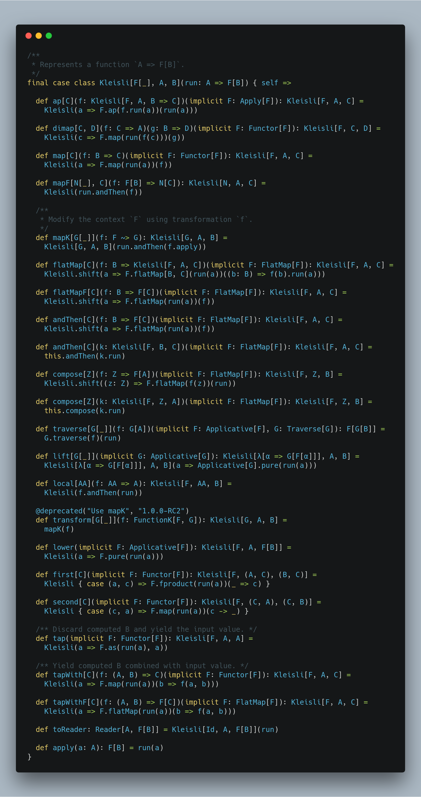

Hi All,

Hope you are doing great!

In this blog post, I am going to explain what is Kleisli or composition of monadic functions and how to use it. Before understanding Kleisli, let&#8217;s learn how to define functions and composition of the functions in Scala.

```scala
val getDataFromDb: Int => Int =(id: Int) => 10 //Assuming it will return Int value from DB
val processNumber: Int => Int       = (v: Int) => v * 2
val writeDataToDB: Int => Boolean = (v: Int) => true // Assuming successful, db write will return Boolean value
```

We have learnt how to define functions in Scala. Here you might be thinking why we have defined functions instead of methods? Because in Scala, Functions and Methods both are not the same thing if I am not wrong. Methods are not values, and you can not compose them without eta expansion. If you want, you can learn more about <a href="https://medium.com/@sinisalouc/on-method-invocations-or-what-exactly-is-eta-expansion-1019b37e010c" target="_blank" rel="noopener">why/what eta expansion</a>and <a href="https://tpolecat.github.io/2014/06/09/methods-functions.html" target="_blank" rel="noopener">why methods are not functions</a>.

Now I am hoping you have understood functions. Nowadays, People are crazy to talk about Functional programming and there is a lot of stuff over the internet to explain what is functional programming and why it needs now but there is a brief definition of functional programming by <span class="username u-dir" dir="ltr"><a class="ProfileHeaderCard-screennameLink u-linkComplex js-nav" href="https://twitter.com/jdegoes" target="_blank" rel="noopener">@<b class="u-linkComplex-target">jdegoes</b></a></span>


**The rest is just composition you can learn over time;** this is what the topic of this blog post.

Let's take an example:

``` scala
scala> val f: String => String = (s: String) => "f(" + s + ")"
f: String => String = $$Lambda$1078/554280593@e521067

scala> val g: String => String = (s: String) => "g(" + s + ")"
g: String => String = $$Lambda$1079/753170002@65d90b7f

scala> val fComposeG = f compose g // It is similar to call f(g("Hello,World"))
fComposeG: String => String = scala.Function1$$Lambda$1080/820069375@452ec287

scala> fComposeG("Hello,World")
res1: String = f(g(Hello,World))

scala> val fAndThenG = f  andThen g  // It is similar to g(f("Hello,World"))
fAndThenG: String => String = scala.Function1$$Lambda$1065/1796415927@40c6d1ef

scala> fAndThenG("Hello,World")
res2: String = g(f(Hello,World))
```

All functions that have single input are syntactic sugar of <a href="https://www.scala-lang.org/api/2.12.7/scala/Function1.html" target="_blank" rel="noopener">Function1[-T1, +R]</a> and it has two functions

```scala
def andThen[A](g: R ⇒ A): T1 ⇒ A
```
Composes two instances of Function1 in a new Function1, with this function applied first.
```scala
def compose[A](g: A ⇒ T1): A ⇒ R
```
Composes two instances of Function1 in a new Function1, with this function applied last.

Now I am hoping; you have understood how to compose functions. Now let's work on the first example.

``` scala
scala> val result = getDataFromDb andThen processNumber andThen writeDataToDB
result: Int => Boolean = scala.Function1$$Lambda$1065/1796415927@25291901

scala> result(12)
res3: Boolean = true
```

Sometimes you want your output in some context to delay your processing or want to run the program in effect. If you want to learn about effects, here is awesome talk about <a href="https://www.youtube.com/watch?v=GZRL5Z40w60" target="_blank" rel="noopener">Functional Programming with Effects</a>

Let's define functions to return monadic value i.e., return value in a context, for instance, an **Option, Either, Try, Future, IO, Reader, Writer** etc:

``` scala
//Below are the Monadic Functions

val getDataFromDbOpt: Int => Option[Int] = (id: Int) => Some(10) 
val processNumberOpt: Int => Option[Int]       = (v: Int) => Some(v * 2)
val writeDataToDBOpt: Int => Option[Boolean] = (v: Int) => Some(true)

val result = getDataFromDbOpt andThen processNumberOpt andThen writeDataToDBOpt
result(12)

//It will give you below compilation error
error: type mismatch;
 found   : scala.this.Function1[scala.this.Int,scala.this.Option[scala.this.Int]]
 required: scala.this.Function1[scala.this.Option[scala.this.Int],?]
  val result = getDataFromDbOpt andThen processNumberOpt andThen writeDataToDBOpt
```

Ops, this is not what we are expecting. Let's fix this error.

```scala
final case class KleisliForOption[A, B](run: A => Option[B]) {
  def andThen[C](k: KleisliForOption[B, C]): KleisliForOption[A, C] =
    KleisliForOption { a => run(a).flatMap(b => k.run(b)) }
}

val getDataFromDbOpt: Int => Option[Int]     = (id: Int) => Some(10)
val processNumberOpt: Int => Option[Int]     = (v: Int) => Some(v * 2)
val writeDataToDBOpt: Int => Option[Boolean] = (v: Int) => Some(true) 

val result = KleisliForOption(getDataFromDbOpt) andThen 
             KleisliForOption(processNumberOpt) andThen
             KleisliForOption(writeDataToDBOpt)
result.run(12) //Output Some(true)
```

Now you can see, we are able to compose functions that have returned monadic value **Option**. What if your functions return monadic value **Either**, 
For example,

``` scala
val getDataFromDbEither: Int => Either[String,Int]     = (id: Int) => Right(10)
val processNumberEither: Int => Either[String,Int]     = (v: Int) => Right(v * 2)
val writeDataToDBEither: Int => Either[String,Boolean] = (v: Int) => Right(true)

val result = KleisliForOption(getDataFromDbEither) andThen
             KleisliForOption(processNumberEither) andThen 
             KleisliForOption(writeDataToDBEither)
result.run(12) 
//It fails with below compilation an error
Error:(12, 112) type mismatch;
 found   : Int => Either[String,Int]
 required: ? => Option[?]
val result = KleisliForOption(getDataFromDbEither) andThen 
             KleisliForOption(processNumberEither) andThen 
             KleisliForOption(writeDataToDBEither)
```

Let's fix this error as well

```scala
final case class KleisliForEither[A, B,E](run: A => Either[E,B]) {
  def andThen[C](k: KleisliForEither[B, C,E]): KleisliForEither[A, C,E] =
    KleisliForEither { a => run(a).flatMap(b => k.run(b))
    }
}

val getDataFromDbEither: Int => Either[String,Int]     = (id: Int) => Right(10)
val processNumberEither: Int => Either[String,Int]     = (v: Int) => Right(v * 2)
val writeDataToDBEither: Int => Either[String,Boolean] = (v: Int) => Right(true)

val result = KleisliForEither(getDataFromDbEither) andThen 
             KleisliForEither(processNumberEither) andThen 
             KleisliForEither(writeDataToDBEither)
result.run(12)//Output Either[String,Boolean] = Right(true)
```

What if your functions return monadic value like Option, Either, Try, <a href="https://www.scala-lang.org/api/2.12.7/scala/concurrent/Future.html" target="_blank" rel="noopener">Future</a>, <a href="https://typelevel.org/cats-effect/datatypes/io.html" target="_blank" rel="noopener">IO</a>, Reader, Writer etc. then you have to define a similar structure for every monadic value as I did. let's not define our structure because the <a href="https://typelevel.org/cats/datatypes/kleisli.html" target="_blank" rel="noopener">same structure</a> is already defined with <a href="https://typelevel.org/cats/" target="_blank" rel="noopener">cats library</a> and it is more powerful than what I have defined.

##Kleisli Type Signature:

The Kleisli type is a wrapper around, `A=>F[B]`

```scala
final case class Kleisli[F[_], A, B](run: A => F[B])
```

Where F is some context that is a Monad, A is an Input and B is an output.

```scala
  import cats.Id
  import cats.effect.IO
  import cats.data.Kleisli
  import cats.implicits._

   //For Option
  val getDataFromDbOpt: Int => Option[Int]     = (id: Int) => Some(10)
  val processNumberOpt: Int => Option[Int]     = (v: Int) => Some(v * 2)
  val writeDataToDBOpt: Int => Option[Boolean] = (v: Int) => Some(true)

  val resultOpt = Kleisli(getDataFromDbOpt) andThen Kleisli(processNumberOpt) andThen Kleisli(
    writeDataToDBOpt)
  resultOpt.run(12) //Option[Boolean]

  //For Id monad
  val getDataFromDbFun: Kleisli[Id, Int, Int]     = Kleisli.apply(id => 10: Id[Int])
  val processNumberFun: Kleisli[Id, Int, Int]     = Kleisli.apply(v => v * 2: Id[Int])
  val writeDataToDBFun: Kleisli[Id, Int, Boolean] = Kleisli.apply(v => true: Id[Boolean])

  val resultFunc = getDataFromDbFun andThen processNumberFun andThen writeDataToDBFun
  resultFunc.run(12) //Id[Boolean] which is Boolean

 //For Either
  type ET[A] = Either[String, A]
  val getDataFromDbEither: Kleisli[ET, Int, Int] =
    Kleisli[ET, Int, Int](id => Right(10))

  val processNumberEither: Kleisli[ET, Int, Int]     = Kleisli[ET, Int, Int](v => Right(v * 2))
  val writeDataToDBEither: Kleisli[ET, Int, Boolean] = Kleisli[ET, Int, Boolean](v => Right(true))

  val result = getDataFromDbEither andThen processNumberEither andThen writeDataToDBEither
  result.run(12) //Either[String,Boolean]

  import scala.concurrent.Future
  import scala.concurrent.ExecutionContext.Implicits.global

  //For Future
  val getDataFromDbFuture: Kleisli[Future, Int, Int] = Kleisli.apply(_ => Future.successful(10))
  val processNumberFuture: Kleisli[Future, Int, Int] = Kleisli.apply(v => Future.successful(v * 2))
  val writeDataToDBFuture: Kleisli[Future, Int, Boolean] =
    Kleisli.apply(_ => Future.successful(true))

  val resultFuture = getDataFromDbFuture andThen processNumberFuture andThen writeDataToDBFuture
  resultFuture.run(12) //Future[Boolean]

  //For IO
  val getDataFromDbIO: Kleisli[IO, Int, Int]     = Kleisli.apply(_ => IO.pure(10))
  val processNumberIO: Kleisli[IO, Int, Int]     = Kleisli.apply(v => IO(v * 2))
  val writeDataToDBIO: Kleisli[IO, Int, Boolean] = Kleisli.apply(_ => IO.pure(true))

  val resultIO = getDataFromDbIO andThen processNumberIO andThen writeDataToDBIO
  resultIO.run(12)/*IO[Boolean]*/.unsafeRunSync() //Boolean
```

You can also use it for-comprehension on Kleisli.

```scala
//For IO
  val getDataFromDbIO: Kleisli[IO, Int, Int]     = Kleisli.apply(_ => IO.pure(10))
  val processNumberIO: Kleisli[IO, Int, Int]     = Kleisli.apply(v => IO(v * 2))
  val writeDataToDBIO: Kleisli[IO, Int, Boolean] = Kleisli.apply(_ => IO.pure(true))

  val anotherFunction: Int => Kleisli[IO, Int, Int] = (v: Int) => Kleisli.liftF(processNumberIO(v))
  val oneMoreFunction: Int => Kleisli[IO, Int, Boolean] = (v: Int) =>
    Kleisli.liftF(writeDataToDBIO(v))
  
  val resultOfFor: Kleisli[IO, Int, Boolean] = for {
    v  <- getDataFromDbIO
    vv <- anotherFunction(v)
    r  <- oneMoreFunction(vv)
  } yield r
  resultOfFor(12).unsafeRunSync()
```
###Implementation of Kleisli

##Conclusion:

Kleisli is just function **A=>F[B]** here F is Monad like Option, Try, Either, IO, Future(it is not completely monad, but it is considered as monad). It enables the composition of functions that return a monadic value or monadic functions like A-> F[B].

##References:  
<a href="https://typelevel.org/cats/datatypes/kleisli.html" target="_blank" rel="noopener">https://typelevel.org/cats/datatypes/kleisli.html</a>